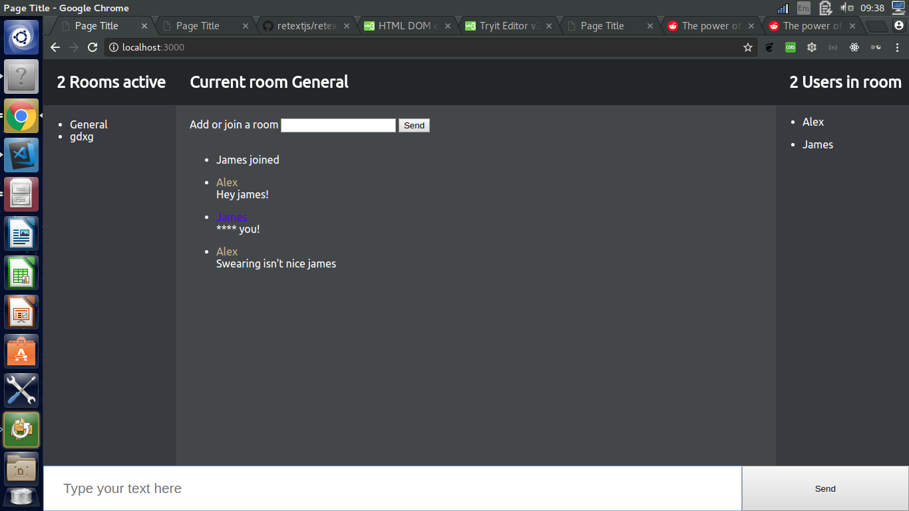

# Real Time Web

- [Real Time Web](#real-time-web)
    - [Purpose of the app](#purpose-of-the-app)
    - [Style of the project](#style-of-the-project)
    - [Feature list](#feature-list)
    - [Wish list](#wish-list)
    - [Requirements](#requirements)
    - [Install guide](#install-guide)
    - [Dependencies](#dependencies)
        - [Api's](#apis)
    - [Internals](#internals)
        - [Types of users](#types-of-users)
            - [`temporary user`](#temporary-user)
            - [`Registered user`](#registered-user)
        - [The handeling of sockets events](#the-handeling-of-sockets-events)
            - [Server Side](#server-side)
                - [`socket.on('logged in user')`](#socketonlogged-in-user)
                    - [Params](#params)
                    - [Function](#function)
                - [`socket.on('spotify user authenticated')`](#socketonspotify-user-authenticated)
                    - [Params](#params)
                    - [Function](#function)
            - [Client Side](#client-side)
                - [`socket.on("check localstorage")`](#socketoncheck-localstorage)
                    - [Params](#params)
                    - [Function](#function)
            - [`socket.emit("new message")`](#socketemitnew-message)

## Purpose of the app
This application aims to offer a solution to real time chat applications. Here you can make your own user groups, see who is online and more.

## Style of the project
For the general codestyle I decided to adhere to the [google style guide](https://google.github.io/styleguide/jsguide.html). This is because it's fairly new and is a bit different then my current coding style, which is mostly based of the airbnb styleguide. With this i hope to be able to slowly form my own coding style.
As for the document structure I decided to use [risingstacks](https://blog.risingstack.com/node-hero-node-js-project-structure-tutorial/) project structure as a baseline.   

Reasoning behind this is that I personally find the MVC document structure most sources recommend quite cluttered, and I prefer to create my app parts as encapsulated as possible.  Down the line i'll probably divert from risingstacks structure slightly, and will document my adaptations here. 

## Feature list

- Dynamic groups. Don't enjoy the general chat? Make one for yourself and your friends
- See who are online
- Vulgarity filter (English only)
- Real-time chat


## Wish list

- [ ] Listen to your favourite tunes with chat buddies
- [ ] Private chat groups
- [ ] Chat history
- [ ] Accounts (Oauth)
- [ ] Friends


## Requirements

`npm` version `v5.6.0`
`node` version `v8.9.4`


## Install guide
```cd app```
Then you can do 
```npm install```
Finally
```npm start```

## Dependencies
The product has been based upon the socket implementation by of `socket.io`.  
For the profanity filter i've used [retext-profanity] (https://github.com/retextjs/retext-profanities)

### Api's
To flair up the functionality, i'm using the [spotify api](https://developer.spotify.com/web-api/) through the ever so handy [spotify-web-api-node](https://github.com/thelinmichael/spotify-web-api-node) node package.

## Internals

### Types of users
Inside the application there are 2 user types:

#### `temporary user`
As the name indicates, these are users that want to use the application but didn't want to register yet. They will be limited to the 'base' usage of the application, that is, without the extra functionality the spotify API provides.

#### `Registered user`
Made the effort to create a account, and is able to use all functionality offered by the web application.


### The handeling of sockets events

#### Server Side

##### `socket.on('logged in user')` 
###### Params
A session.user object to validate & register in the socket.
###### Function
WIP, endpoint that should be called from the server to indicate that the user logged in to a account in the database. 


##### `socket.on('spotify user authenticated')`
###### Params
The authenticated generated for the user. Will be passed down by the client after the generation has been completed
###### Function

#### Server side

#### Client Side

##### `socket.on("check localstorage")` 
###### Params
`localStorageKeyNames (Required) `: List of LocalStorage namespaces, used to check if these namespaces contain any user information.  

###### Function
Checks localstorage to see if there is a temporary user in the localstorage. Should only be called if the session is empty & the user has logged in with a [temporary user](#temporary-user) before.

#### `socket.emit("new message")`

